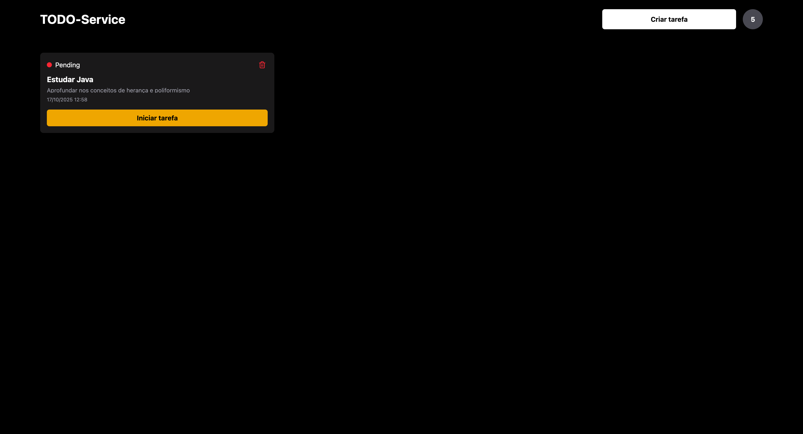

<h1 align="center" style="color: #805ad5; font-weight: bold;">TODO Executiva-Service 📞</h1>

<p align="center">
 <a href="#tech">Technolgies</a> • 
 <a href="#clone">Clone</a> • 
 <a href="#contribute">Contribute</a> •
 <a href="#license">License</a>
</p>

<p align="center">
<b>O TODO Service é uma aplicação moderna e intuitiva desenvolvida para ajudar você a organizar e gerenciar suas tarefas do dia a dia de forma simples e eficiente.

Com ela, é possível criar, atualizar e excluir tarefas em poucos cliques, mantendo o foco no que realmente importa.
Cada tarefa possui um status visual — pendente, em andamento ou concluída — facilitando o acompanhamento do progresso das suas atividades.

A interface é minimalista, responsiva e agradável, oferecendo uma experiência fluida tanto no desktop quanto no mobile.</b>
</p>
<p align="center">
  <p>
    
    
  </p>
  <p>
    
    
    
    
    
    


  </p>
</p>


<h2 id="tech">Technologies</h2>

### Client:
  Interface construida com ReactJS 

### Server
  Backend construido com NodeJS, 

<h2 id="clone">Clone</h2>

<h4> Prerequisites</h4>

- Node >= v22.18.0 e PMPM >= 10.15 
- Package manager - PNPM

<h4>Starting</h4>

```
git clone https://github.com/vinnycosta9898/todo-executiva-service.git
pnpm install
```

Crie um aquivo .env na raiz do projeto e adicione o endereco de conexao 
com o banco sqLite
```
DATABASE_URL="file:./dev.db"
```

Apos isso adione tambem uma JWT secret para o sistema de autenticacao
```
JWT_SECRET=example_key
```

Rode as alteracoes no prisma
```
npx prisma migrate dev
```


<h5>Start server</h5>

```
  //in root
  pnpm run dev
```

<h5>Start Client</h5>

```
  cd frontend
  pnpm run dev
```

<h2 id="contribute">Contribute 🚀</h2>


```bash
git clone https://github.com/vinnycosta9898/todo-executiva-service.git 
```


<h2 id="license">License 📃 </h2>


